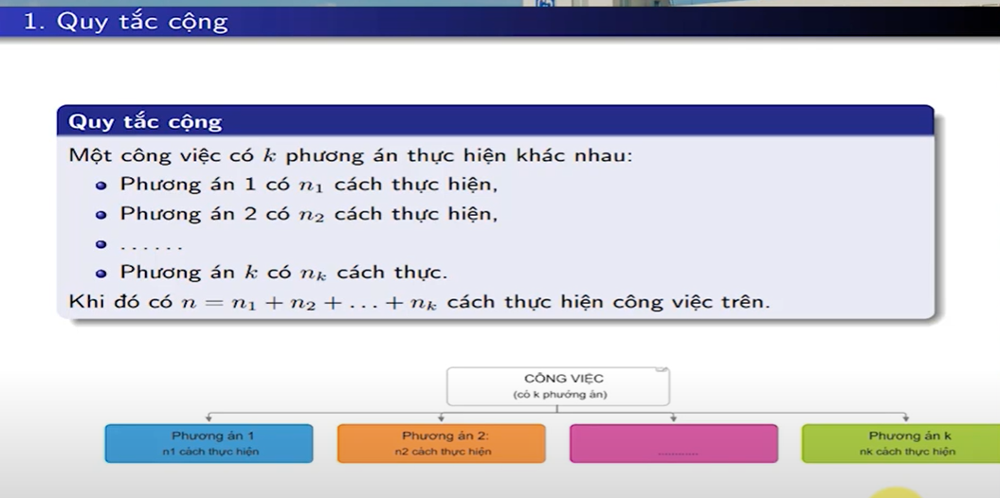
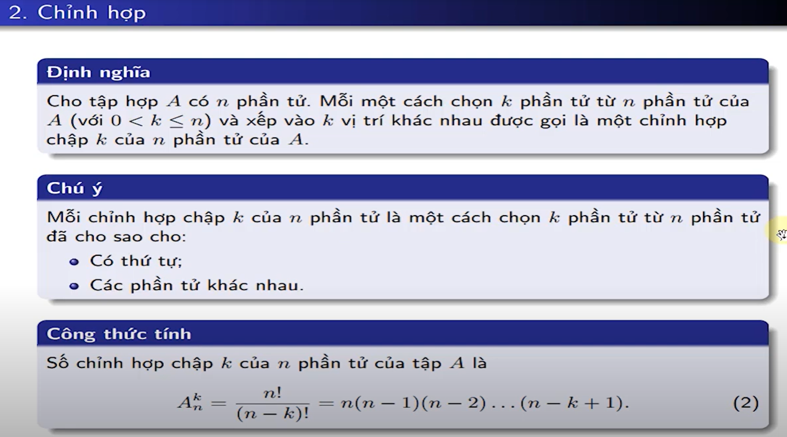
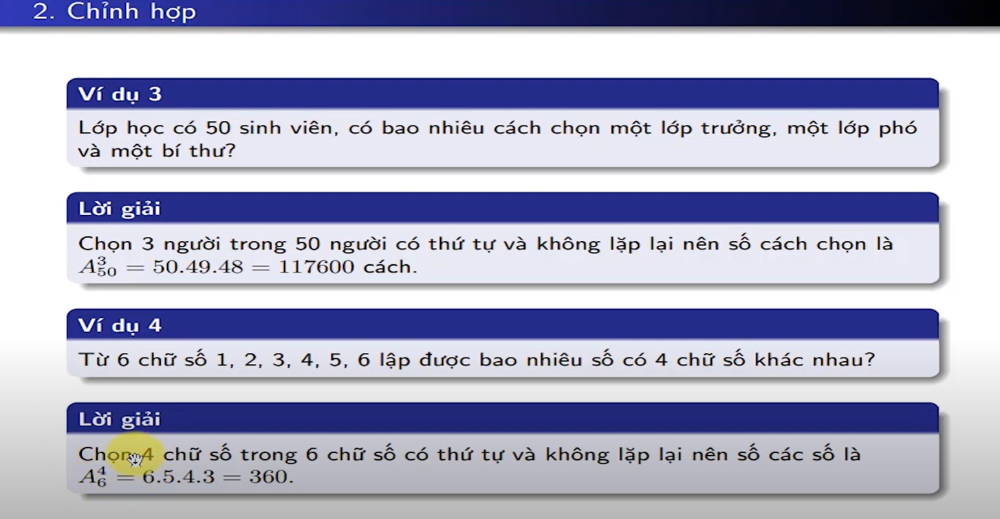
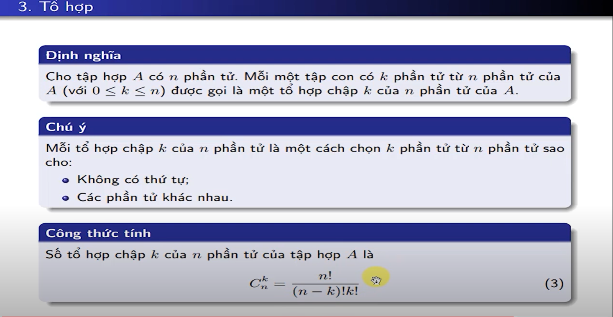
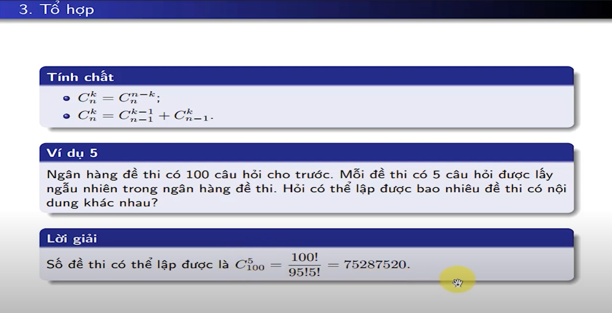
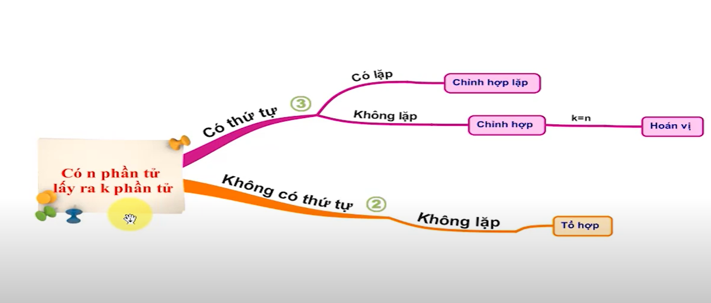

## Chuong 1: Các khái niệm cơ bản về xác suất

## Bài 1

> quy tắc cộng
> 

> chỉnh hợp công thức
> 

> chỉnh hợp 2
> 

```
50P3 / nhập từ dưới lên, ấn nút 'shift + dấu nhân' để  có cái nút này 'P' hay còn gọi là nút chỉnh hợp
```

> tổ hợp
> 

> tổ hợp 2
> 

```
100C5 / nhập từ dưới lên, ấn nút 'shift + dấu chia' để  có cái nút này 'C' hay còn gọi là nút tổ hợp
```

> [Cách bấm xác suất trên máy tính](https://www.thegioididong.com/hoi-dap/cach-bam-xac-suat-tren-may-tinh-cam-tay-may-tinh-bo-tui-1392595)

> Tree => tổng hợp lại bài 1
> 
